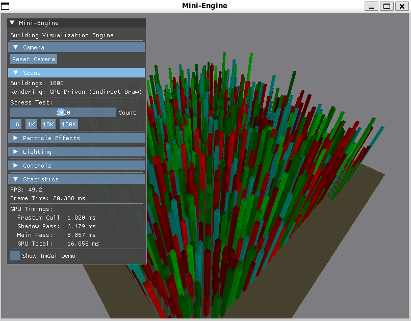
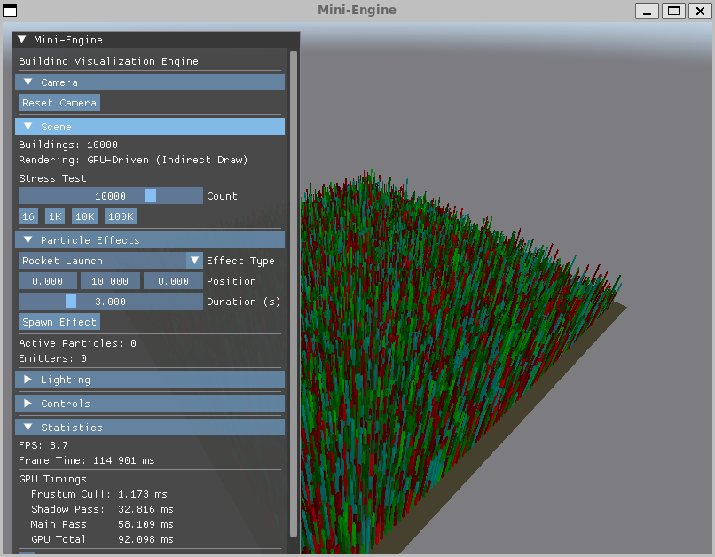
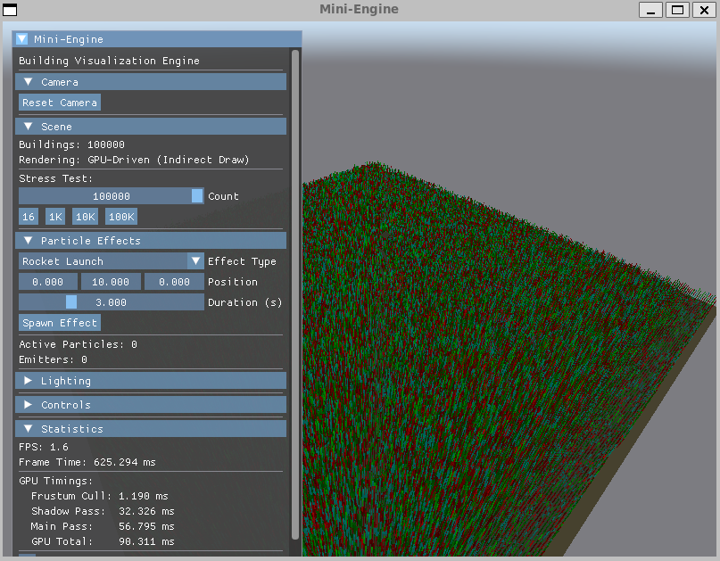

# Mini-Engine: Portfolio

> Vulkan Tutorial의 단일 파일(467줄)에서 PBR & GPU-Driven 렌더링 엔진(25,000+ LOC)까지 — 5단계 아키텍처 진화 기록

---

## 프로젝트 개요

| 항목 | 내용 |
|------|------|
| **프로젝트명** | Mini-Engine |
| **유형** | 실시간 3D 렌더링 엔진 (개인 프로젝트) |
| **기술 스택** | C++20, Vulkan 1.3, WebGPU, GLSL/WGSL, CMake, vcpkg |
| **규모** | 25,000+ LOC, 50+ 클래스/모듈 |
| **플랫폼** | Linux, macOS, Windows, Web(WASM) |
| **주요 기능** | Cook-Torrance PBR, IBL, GPU Frustum Culling, Indirect Draw, Shadow Mapping, Async Compute |

---

## Stage 1: Monolith에서 Layered Architecture로

### 무엇을 바꿨는가

467줄짜리 단일 파일(`main.cpp`)에서 4-Layer 아키텍처로 전환. 11개 Phase에 걸쳐 점진적으로 레이어를 분리했다.

```plaintext
Before: main.cpp (467 LOC, 모든 로직)
After:  Application -> Rendering -> Resource -> Core (4-Layer, RAII 100%)
```

### 핵심 도전: 크로스 플랫폼 렌더 패스 전략

**문제**
Linux는 Vulkan 1.1만 지원(`lavapipe`), macOS/Windows는 1.3 지원. Dynamic Rendering API가 Linux에서 크래시 발생.

**해결**
최하위 버전으로 통일하는 대신, **플랫폼별 최적 경로 선택:**
- Linux: Traditional Render Pass (모든 렌더링이 하나의 pass 안에서 완료)
- macOS/Windows: Dynamic Rendering (유연한 pass 관리)

**임팩트**
단일 코드베이스로 3개 플랫폼 지원. 각 플랫폼에서 **최신 API 기능 활용** 가능.

### 성과

| 지표 | Before | After |
|------|--------|-------|
| **코드 구조** | 467줄 단일 파일 | **25+ 모듈, 4-Layer** |
| **메모리 관리** | 수동 alloc/free | **RAII 100%** (메모리 누수 0) |
| **플랫폼** | 단일 | **Linux, macOS, Windows** |
| **Validation Error** | 가변 | **0** |

---

## Stage 2: Layered Architecture에서 RHI Architecture로

### 무엇을 바꿨는가

Vulkan API에 종속된 상위 레이어를 **15개 추상 인터페이스**로 분리. WebGPU 스타일 API 설계로 멀티 백엔드 지원 기반 마련.

```plaintext
Before: Renderer -> Vulkan API (직접 호출, 벤더 종속)
After:  Renderer -> RHI (15 interfaces) -> Vulkan Backend (3,650 LOC)
```

### 핵심 도전: Vulkan 동기화 모델 재설계

**문제**
프레임 동기화 버그 발생. `present()`가 렌더링 완료를 기다리지 않고, 다음 프레임에서 세마포어를 **이중 시그널링**하여 크래시.

**원인 분석**
- `frame-in-flight` 인덱스(CPU 논리적 프레임)와 `swapchain image` 인덱스(GPU 물리적 이미지)를 혼용
- 세마포어 소비 경로 누락

**해결**
두 개념을 명확히 분리:
- 세마포어/펜스 → `m_currentFrame` (0~1 순환)
- Framebuffer/ImageView → `m_currentImageIndex` (swapchain 결정)
- `present(RHISemaphore*)` 인터페이스 추가로 세마포어 소비 명시

**임팩트**
동기화 버그 0건. RHI 인터페이스가 Vulkan의 복잡한 동기화 개념을 **올바르게 추상화**했음을 검증.

### 성과

| 지표 | Before | After |
|------|--------|-------|
| **API 종속성** | Vulkan 100% | **0% (상위 레이어)** |
| **멀티 백엔드** | 불가능 | Vulkan 구현 완료 |
| **레거시 코드** | ~890 LOC | **삭제** |
| **vtable 오버헤드** | - | **< 2%** (측정됨) |

---

## Stage 3: WebGPU 백엔드 구현

### 무엇을 바꿨는가

RHI 아키텍처의 가치를 실증하기 위해 **두 번째 그래픽스 백엔드** 구현. 웹 브라우저에서 동일 엔진 실행 성공.

```plaintext
Vulkan Backend (3,650 LOC) + WebGPU Backend (6,500 LOC)
-> RHI 인터페이스 변경 0건
```

### 핵심 도전: WASM 빌드 실패 "section too large"

**문제**
`WebGPUCommon.hpp`에 ~25개의 enum 변환 inline 함수가 13개 .cpp 파일마다 중복 인스턴스화. **코드 비대화**로 wasm-ld가 빌드 거부.

**해결**
- inline 함수를 `.cpp` 파일로 분리 (헤더에서 구현 제거)
- Emscripten 최적화: `-Oz` (크기 최적화) + `-flto` (Link-Time Optimization)

**임팩트**
빌드 실패 → 성공. **최종 WASM 156KB** (gzip 후 ~40KB). 모바일 환경에서도 즉시 로드 가능.

### 성과

| 지표 | 결과 |
|------|------|
| **WebGPU Backend** | 15개 클래스, 6,500 LOC |
| **WASM 크기** | **156KB** (.wasm + .js) |
| **RHI 인터페이스 수정** | **0건** (추상화 검증 완료) |
| **지원 플랫폼** | Linux, macOS, Windows, **Web** |

---

## Stage 4: GPU Instancing & Shadow Mapping

### 무엇을 바꿨는가

단일 OBJ 렌더러를 **수천 개 오브젝트** 처리가 가능한 인스턴싱 엔진으로 확장. Directional Shadow Mapping 추가.

```plaintext
Before: 1 object = 1 draw call (Blinn-Phong, 그림자 없음)
After:  N objects = 1 draw call (GPU Instancing, PCF Shadow)
```

### 핵심 도전: Shadow Map NDC 좌표계 이슈

**문제**
Shadow map이 씬의 **절반만 렌더링**. 가까운 오브젝트들의 그림자가 사라지는 현상.

**원인 분석**
`glm::ortho`는 OpenGL 스타일로 Z를 [-1, 1]로 매핑. Vulkan은 [0, 1]을 기대 → 음수 Z 좌표가 클리핑됨.

**해결**
Light projection matrix의 Z 매핑을 수동으로 Vulkan NDC로 변환:
```cpp
lightProj[2][2] = -1.0f / (farPlane - nearPlane);   // Z scale
lightProj[3][2] = -nearPlane / (farPlane - nearPlane); // Z offset -> [0, 1]
```
추가로 Shadow Pass에서 **front-face culling**을 적용하여 Peter Panning(그림자 분리) 문제 해결. back-face만 shadow map에 기록하므로 bias가 거의 불필요.

**임팩트**
씬 전체를 커버하는 정확한 그림자. OpenGL/Vulkan NDC 차이를 근본적으로 이해.

### 성과

| 지표 | Before | After |
|------|--------|-------|
| **Draw Call** | 1 object = 1 call | **N objects = 1 call** |
| **게임 로직** | 없음 | Entity/Manager 패턴 |
| **그림자** | 없음 | **Directional Shadow + PCF** |
| **렌더링 오브젝트** | 단일 OBJ | **수천 개 인스턴스** |

---

## Stage 5: PBR & GPU-Driven 렌더링 파이프라인

### 무엇을 바꿨는가

Blinn-Phong을 **Cook-Torrance PBR + IBL**로 교체. CPU 드라이브 인스턴싱을 **GPU-Driven 간접 렌더링**으로 전환.

```plaintext
Before: CPU가 draw call 발행 (Blinn-Phong)
After:  GPU가 draw call 결정 (PBR + IBL + Frustum Culling + Indirect Draw)
```

**구현 내역**
- **PBR:** GGX, Smith-Schlick Geometry, Fresnel-Schlick
- **IBL:** 4개 Compute Shader로 전처리 파이프라인 (Equirect→Cubemap, Irradiance, Prefiltered Env, BRDF LUT)
- **GPU Culling:** Compute Shader로 frustum culling, atomic counter로 visible 카운트
- **Indirect Draw:** `drawIndexedIndirect` — GPU가 instanceCount 직접 결정
- **Async Compute:** Timeline Semaphore로 graphics ↔ compute 병렬 실행
- **GPU Profiling:** `vkCmdWriteTimestamp`로 pass별 GPU 타이밍


*1K 오브젝트 렌더링 (47 FPS)*


*10K 오브젝트 렌더링 (8 FPS)*


*100K 오브젝트 렌더링 (0.5 FPS)*

### 핵심 도전 1: Async Compute 하드웨어 폴백

**문제**
Apple M1 같은 GPU는 dedicated compute queue가 **없음**. Timeline semaphore도 미지원하여 크래시.

**해결**
`RHIFeatures`에 capability 체크 추가:
- `dedicatedComputeQueue` && `timelineSemaphores` → Async Compute 활성화
- 미지원 시 → Graphics queue에서 inline compute로 폴백

**임팩트**
단일 큐 GPU에서도 안정적으로 동작. **하드웨어 다양성에 대응하는 설계 검증**.

### 핵심 도전 2: CPU 병목 발견 (100K 오브젝트)

**측정 결과**
GPU Profiling으로 Frame Time을 분석한 결과, **CPU가 진짜 병목**이었음을 발견:

| 오브젝트 | FPS | Frustum Cull | Shadow Pass | Main Pass | GPU Total | Frame Time |
|---------|-----|-------------|-------------|-----------|-----------|------------|
| **1K** | 47 | 1 ms | 6 ms | 10 ms | **17 ms** | 21 ms |
| **10K** | 8 | 1 ms | 34 ms | 61 ms | **95 ms** | 125 ms |
| **100K** | 0.5 | 2 ms | 193 ms | 329 ms | **530 ms** | **2022 ms** |

**인사이트**
- Frustum Culling은 **O(1)** — Compute Shader 병렬성 입증
- Shadow Pass가 가장 비쌈 — Light-space culling 미적용
- **GPU Total 530ms < Frame Time 2022ms** → ObjectData 생성이 CPU 병목

**다음 최적화 타겟**
- Persistent SSBO + dirty tracking으로 CPU 업데이트 최소화
- Light-space frustum culling으로 Shadow Pass 최적화

**임팩트**
GPU-Driven 렌더링을 도입하면 기존에 가려져 있던 **CPU 병목이 드러남**을 실증. 프로파일링 기반 최적화의 중요성 입증.

### 성과

| 지표 | Before | After |
|------|--------|-------|
| **라이팅** | Blinn-Phong | **Cook-Torrance PBR + IBL** |
| **Culling** | 없음 | **GPU Frustum Culling (Compute)** |
| **Draw Call 제어** | CPU | **GPU (Indirect Draw)** |
| **최대 오브젝트** | 수천 | **100K+ (0.5 FPS)** |
| **병렬 실행** | 없음 | **Async Compute (graphics ↔ compute)** |
| **프로파일링** | 없음 | **vkCmdWriteTimestamp per-pass** |

---

## 최종 아키텍처

```plaintext
Application Layer
  Application, Camera, Input, ImGui (PBR controls, GPU timing, stress test)
      │
High-Level Subsystems (API-Agnostic)
  Renderer (PBR, Shadow, GPU Culling, Indirect Draw)
  IBLManager, ShadowRenderer, SkyboxRenderer, ParticleRenderer
  BuildingManager, WorldManager, ResourceManager, SceneManager
      │
RHI (Render Hardware Interface)
  15개 추상 인터페이스 (pure virtual)
  RHIDevice, RHIBuffer, RHITexture, RHIPipeline, ...
  RHIFactory (런타임 백엔드 선택)
      │
Backend Implementations
  ┌─────────────────┐  ┌──────────────────┐
  │  Vulkan Backend │  │  WebGPU Backend  │
  │  (Desktop)      │  │  (Web/WASM)      │
  │  VMA, SPIR-V    │  │  Emscripten      │
  │  ~8,000 LOC     │  │  WGSL, ~6,500 LOC│
  └─────────────────┘  └──────────────────┘
```

---

## 전체 수치 비교

| 지표 | 시작점 | 최종 |
|------|--------|------|
| main.cpp | 467줄 | 18줄 |
| 총 코드 | ~467 LOC | ~25,000+ LOC |
| 클래스/모듈 | 0 | 50+ |
| 그래픽스 API | Vulkan only | Vulkan + WebGPU |
| 렌더링 | Blinn-Phong | Cook-Torrance PBR + IBL |
| 오브젝트 처리 | 단일 모델 | 100K+ GPU-Driven |
| Draw Call | CPU drawIndexed | GPU drawIndexedIndirect |
| Culling | 없음 | GPU Frustum Culling (Compute Shader) |
| Shadow | 없음 | Directional Shadow Mapping + PCF |
| 프로파일링 | 없음 | vkCmdWriteTimestamp per-pass GPU timing |
| 메모리 관리 | 수동 vkAllocateMemory | VMA + Memory Aliasing |
| 플랫폼 | 단일 | Linux, macOS, Windows, Web |

---

## 핵심 교훈

### 1. 단계적 리팩터링 > 전면 재작성
11개 Phase에 걸쳐 매 단계마다 빌드/실행 검증. 한 번에 모든 것을 바꾸려 했다면 중간에 포기했을 것.

### 2. 인터페이스 설계가 구현보다 중요
RHI를 WebGPU 스타일로 설계한 덕분에 두 번째 백엔드 추가가 자연스러웠음. **인터페이스 변경 0건**으로 WebGPU 백엔드 완성.

### 3. GPU 최적화는 CPU 병목을 드러낸다
GPU Frustum Culling은 O(1)이지만, 100K 오브젝트에서 CPU ObjectData 생성이 진짜 병목. GPU-Driven을 도입할수록 **CPU 비효율이 표면 위로 올라온다**.

### 4. 좌표계 차이는 미묘하지만 치명적
OpenGL vs Vulkan NDC 차이(Y축 반전, Z range)는 Shadow Mapping, IBL 등에서 반복적으로 문제를 일으킴. **디버깅 시각화**(Shadow Map을 ImGui에 렌더링)가 가장 효과적인 해결책.

### 5. 하드웨어 다양성에 대응하는 설계
Apple M1같은 단일 큐 GPU는 async compute가 불가능. **항상 capability 체크 + 폴백 경로** 제공이 필수.

---

*문서 작성: 2026-02-09*  
*개발 기간: 2025.09 ~ (진행 중)*

## 주요 기능

### 1. **RHI**(Render Hardware Interface) 아키텍처

15개의 순수 추상 인터페이스로 구성된 RHI 레이어를 통해 플랫폼 독립적인 렌더링을 구현:

```cpp
// RHI 추상화 예시
class RHIDevice;
class RHISwapchain;
class RHIPipeline;
class RHIBuffer;
class RHITexture;
// ... 15개 인터페이스
```

**계층 구조:**
```plaintext
- Layer 1: Application (플랫폼 독립적)
- Layer 2: High-Level Subsystems (API 독립적)
- Layer 3: RHI Abstractions (15개 인터페이스)
- Layer 4: Backend Implementations (Vulkan, WebGPU)
```

### 2. 물리 기반 렌더링 **PBR**(Physically Based Rendering)

**Cook-Torrance BRDF 구현:**
- Metallic/Roughness 워크플로우
- **NDF**(Normal Distribution Function) - GGX
- Fresnel-Schlick 근사
- Smith Geometry Function

**IBL**(Image Based Lighting):
- HDR 환경 맵 지원
- **Irradiance Convolution**(확산 조명)
- **Prefiltered Specular**(반사 조명)
- BRDF Integration LUT

### 3. GPU-Driven 렌더링

**성능 최적화:**
```cpp
// SSBO 기반 per-object 데이터
struct ObjectData {
    mat4 model;
    vec4 color;
    uint materialIndex;
    // 128 바이트 정렬
};

// Compute Shader Frustum Culling
layout(local_size_x = 256) in;
void main() {
    // AABB-plane test
    // Atomic indirect draw count
}
```

**성능 지표:**
- 100,000+ 오브젝트 @ 60 FPS
- Indirect Drawing으로 단일 드로우콜
- Compute Shader 기반 Frustum Culling

### 4. 멀티 백엔드 지원

#### Vulkan 1.3 Backend (완성)
- **VMA**(Vulkan Memory Allocator) 통합
- SPIR-V 셰이더 컴파일
- **Dynamic Rendering**(macOS/Windows)
- Layout Transition 자동 관리

#### WebGPU Backend (완성)
- Emscripten WASM 빌드
- SPIR-V -> WGSL 자동 변환
- 브라우저 WebGPU API 활용
- 185KB WASM 번들 크기

## 개발 과정 및 리팩터링

### Phase 1-7: Monolith to Layered Architecture

단일 파일 **main.cpp**(main.cpp) 구조에서 20+ 재사용 가능한 클래스로 분리:

**개선 지표:**
| 메트릭 | Before | After | 개선도 |
|--------|--------|-------|--------|
| 파일 수 | 1 | 50+ | 모듈화 |
| 클래스 수 | 0 | 20+ | 재사용성 |
| RAII 커버리지 | None | 100% | 메모리 안전 |
| 플랫폼 | 1 | 3+ | 크로스 플랫폼 |

### Phase 8-9: RHI Migration

완전한 플랫폼 독립 달성:

- Vulkan 의존성 제거 **Application Layer**(Application Layer)
- TextureLayout enum 추가
- Layout Transition 메소드 구현
- Zero Platform Leakage 달성

## 프로젝트 통계

```plaintext
총 코드 라인: ~24,900 LOC
- Vulkan Backend: ~8,000 LOC
- WebGPU Backend: ~6,500 LOC
- RHI Abstraction: ~400 LOC
- Application: ~9,000 LOC

파일 수: 100+
클래스 수: 20+
```

## 빌드 및 실행

### Desktop (Vulkan)
```bash
cmake --preset linux-default
make build
./build/vulkanGLFW
```

### Web (WebGPU)
```bash
make setup-emscripten  # 자동 Emscripten 설치
make wasm              # WASM 빌드
make serve-wasm        # http://localhost:8000
```

## 핵심 설계 원칙

1. **API Abstraction:** 그래픽 API가 백엔드 구현에만 격리
2. **Dependency Rule:** 상위 레이어는 RHI 추상화에만 의존
3. **Single Responsibility:** 각 클래스는 하나의 명확한 책임
4. **RAII:** `vk::raii::*` 래퍼를 통한 자동 리소스 관리
5. **Zero-Cost Abstraction:** 가상 함수 오버헤드 < 5%

## 향후 계획

- [ ] DirectX 12 Backend 구현
- [ ] Metal Backend 구현  
- [ ] 고급 애니메이션 시스템
- [ ] Scene Graph 최적화
- [ ] 물리 엔진 통합

## 기술 문서

- [프로젝트 요약](https://github.com/nowead/Mini-Engine/blob/main/docs/SUMMARY.md)
- [RHI 아키텍처](https://github.com/nowead/Mini-Engine/blob/main/docs/refactoring/layered-to-rhi/ARCHITECTURE.md)
- [WebGPU Backend](https://github.com/nowead/Mini-Engine/blob/main/docs/refactoring/webgpu-backend/SUMMARY.md)
- [빌드 가이드](https://github.com/nowead/Mini-Engine/blob/main/docs/BUILD_GUIDE.md)

---

**개발 기간:** 2025.09 ~ (진행 중)  
**주요 기술:** C++20, Vulkan 1.3, WebGPU, PBR, IBL, GPU-Driven Rendering, RAII, RHI Pattern
